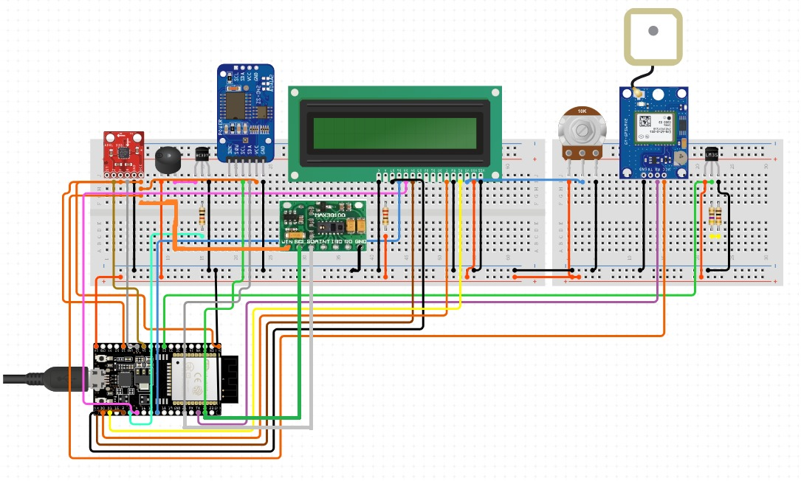

# Smart-Watch-using-ESP32-Microcontroller
This project involves the design and development of a smart watch built using the ESP-32 microcontroller, specifically tailored to assist elderly individuals in monitoring their health and safety.The device integrates multiple sensors and features to provide comprehensive real-time tracking of vital parameters and daily activities.\
The ESP-32’s built-in Wi-Fi and Bluetooth capabilities allow for seamless data transmission to a connected smartphone or cloud-based platform, enabling remote monitoring and emergency alerts. This project emphasizes user safety, health awareness, and peace of mind,especially for families caring for elderly members.

## Key Features !!
1. Fall Detection: Utilizes accelerometer and gyroscope sensors to detect sudden movements or impacts, alerting caregivers or family members in case of a fall.
2. Health Monitoring: Tracks vital signs such as body temperature and pulse rate using integrated sensors.
3. Location Tracking: GPS functionality allows for real-time live location tracking, ensuring the user’s safety and enabling quick assistance if needed.
4. Activity Monitoring: Records physical movement throughout the day, offering insights into daily activity levels.
5. Real-Time Clock Display: An LED display shows the current time and other key information in a clear and readable format.
6. Telegram Bot channel: It detect the fall and  informed through the telegram that the fall is detected.

## Circuit Diagram

## Pin Configuration for Various Components for ESP32-based Smart Watch 
| **Component**                    | **ESP32 Pin(s)**                                     |
|----------------------------------|------------------------------------------------------|
| LM35 (Temperature Sensor)        | GPIO34 (VP)                                          |
| MPU6050 (Accelerometer/Gyro)     | SDA = GPIO21, SCL = GPIO22                           |
| RTC DS1307                       | SDA = GPIO21, SCL = GPIO22                           |
| Buzzer                           | GPIO5                                                |
| 16x2 LCD (Parallel Mode)         | RS = GPIO14, EN = GPIO27, D4 = GPIO26, D5 = GPIO25, D6 = GPIO33, D7 = GPIO32 |
| WiFi (Built-in)                  | N/A                                                  |

## Challenges Faced During Development 👾
1. **Sensor Integration and Compatibility**\
Integrating multiple sensors (like LM35, MPU6050, RTC DS1307) with the ESP32 was complex due to limited GPIO pins and potential I2C address conflicts. Careful pin allocation and understanding of communication protocols were required to ensure stable operation. 
2. **Power Management**\
Managing the power consumption was a major challenge since wearable devices need to be energy-efficient. We had to optimize the code and sensor usage to ensure that the watch could run longer on a single charge without frequent recharging. 
3. **Fall Detection Accuracy**\
Developing a reliable fall detection algorithm using the MPU6050 sensor involved analyzing real-time acceleration and orientation data. Differentiating between actual falls and normal movements (like sitting or bending) required significant fine-tuning. 
4. **Real-Time Data Processing** \
The ESP32 has limited processing power compared to full-scale processors. Managing real-time sensor data, display updates, and wireless communication simultaneously was challenging and required efficient coding practices and memory management. 
5. **Limited Display Interface**\
Displaying relevant information clearly on a 16x2 LCD screen was challenging due to the small size and limited characters. We had to prioritize what data to show and design a user-friendly layout suitable for elderly users with possibly limited vision. 
6. **Wi-Fi Connectivity and Stability** \
Though the ESP32 has built-in Wi-Fi, maintaining stable and continuous connectivity—especially for live tracking and alert systems—was sometimes unreliable due to network fluctuations and required retries and error handling. 
7. **Enclosure Design and Wearability**\
Making the prototype compact, lightweight, and comfortable enough to be worn on the wrist like a real watch was a mechanical challenge. Housing all components in a small, wearable form factor without overheating or wiring issues took several iterations. 
8. **User-Friendliness for the Elderly**\
Designing a system that was intuitive and non-intrusive for elderly users was critical. We had to consider ease of use, minimal button interaction, and automatic operation to avoid confusion or misuse. 
9. **Sensor Calibration and Noise Filtering** \
Raw sensor data, especially from MPU6050 and LM35, was noisy and inconsistent at times. Implementing proper filtering techniques (e.g., moving average filters) and calibration methods was necessary for reliable readings. 
10. **Time Synchronization Issues**\
Ensuring the RTC maintained accurate time, especially after power resets or battery changes, required implementing backup mechanisms and periodic time syncing to avoid drift.
